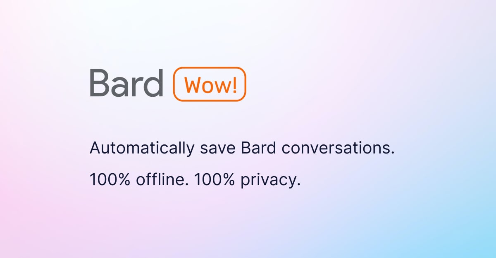

<h1 align="center"> Bard Wow!</h1>

  Save & share Bard conversations. Discover & use Bard prompts. Enhance Bard with more features.

  <a href="#introduction"><strong>Introduction</strong></a> ·
  <a href="#how-to-use"><strong>How To Use</strong></a> ·
  <a href="#how-to-contribute"><strong>How To Contribute</strong></a> ·
  <a href="#license"><strong>License</strong></a>

 

## Introduction

_Bard Wow!_ is an open-source Chrome extension that enhance [Bard](https://bard.google.com) with more features:

- Automatically save all of your Bard chats

- Go back to your Bard chat history

- All of your Bard chats are saved locally

- 100% offline, 100% privacy, no data sent to server (unless you enable sync & share chats)

- Search your Bard chat history (soon)

- Share your Bard chats to the web & others (soon)

- Use Bard prompts in one-click (soon)

- Discover best Bard prompts from the community (soon)

- Create & save your Bard prompts (soon)

## How To Use

1. Go to [Releases](https://github.com/phuctm97/bardwow/releases), download `Chrome.zip` file from the release assets.

2. Extract the contents of the `Chrome.zip` file to a folder on your computer.

3. Open Google Chrome and go to the extensions page by typing `chrome://extensions` in the address bar.

4. Enable Developer mode by toggling the switch in the top right corner of the page.

5. Click on the "Load unpacked" button in the top left corner of the page.

6. Browse to the folder where you extracted the `Chrome.zip` file and select it.

7. The extension should now be installed and ready to use.

8. Just use Bard normally like you already do, all your chats are automatically saved.

9. To see your saved chats, click on "⠇" next to the extension icon, & click on 'Options' to open the extension Options page

## How To Contribute

We love our contributors! Here's how you can contribute:

- [Open an issue](issues) if you believe you've encountered a bug or got a feature request.

- Make a [pull request](pulls) to add new features/make quality-of-life improvements/fix bugs.

For local development, follow the instructions below:

### Setup requirement

- Node.js 18+

- NPM 9+

### Start development

1. Clone the repository and run `npm i` in the repository directory to initialize the repository.

2. Run `npm run build` to build the repository, you'll find the Chrome extension built output in `apps/extension/out` directory.

3. Follow [How To Use](#how-to-use) to load the extension into your browser but instead of using `Chrome.zip`, choose `apps/extension/out` directory.

4. Make changes to the codebase, run `npm run build` & reload the extension to test.

### Understand the repository

- The repository is an NPM monorepo using the following tech stack:

  - [TypeScript](https://www.typescriptlang.org/) – Language
  - [Tailwind](https://tailwindcss.com/) – CSS

- [`apps`](apps) includes all the project's entry points, e.g. extension background script, extension content script, website, etc.

- [`packages`](packages) includes utility packages & scripts.

## Author

_Minh-Phuc Tran_ ([@phuctm97](https://twitter.com/phuctm97))

## License

_Bard Wow!_ is open-source under the GNU Affero General Public License Version 3 (AGPLv3) or any later version. You can [find it here](LICENSE).
